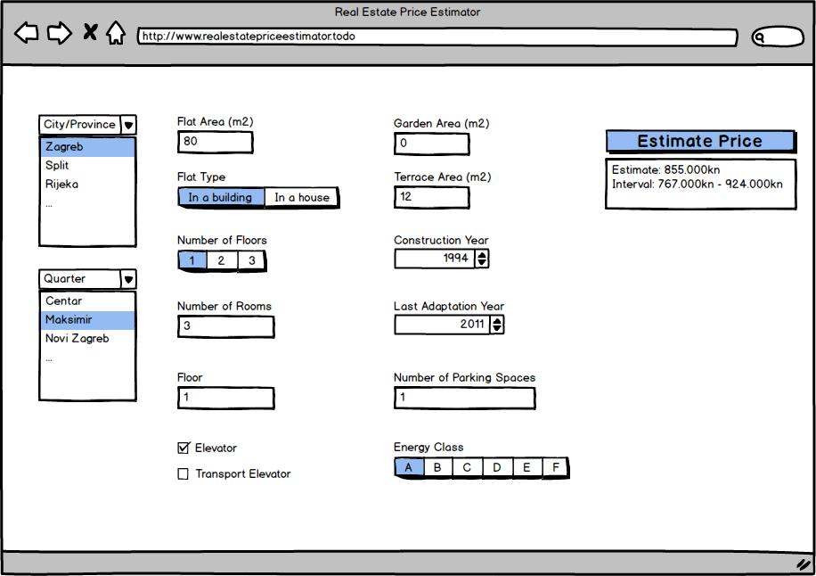

```{r setup, include=FALSE}
knitr::opts_chunk$set(echo = FALSE)
```


```{r, echo=FALSE, out.width = "500px", fig.align='center'}

```


## Problem

One of the most important questions in real estate business is how to estimate the current market value of a property. It obviously depends on some variables like area, location etc. but which of these variables influence the price the most and how to assess each variable's influence on the price? 

We will answer this question for one example, using data taken from real, existing flat selling ads to predict the flat prices. This model can then be used to make good price estimates for flats based on parameters like flat size, location, number of rooms etc.

## Data

The data used to create the model consists of:

* Price, the variable that we want to predict related to the other variables.

* 16 other variables, related to different aspects of the flat in the ad (town, quarter, flat area, number of rooms, floor, construction year, last adaptation year...). Some variables exist in the original ads and some we created to make the analysis and modelling easier.

We had a total of around 7500 ads - data entries.


```{r echo=FALSE, warning=FALSE, message=FALSE}

setwd("C:\\OnlineSync\\Mega\\R\\work\\web_scraping")

if(!exists("hellofunction", mode="function")) source("../functions.R")


library('ggplot2')

### --> data preparation
library(dplyr)
library(data.table)


### Analysis

all_ads = data.frame()
ads_files = list.files(pattern = "all_ads_[0-9]+.RDS")
ads_read = lapply(ads_files, FUN = function(ad_file) {
  ads_000 = readRDS(ad_file)
  all_ads <<- rbind(all_ads, ads_000, stringsAsFactors = F)
})

all_ads$zupanija = factor(all_ads$zupanija)
all_ads$grad_opcina = factor(all_ads$grad_opcina)
all_ads$naselje = factor(all_ads$naselje)
all_ads$tip_stana = factor(all_ads$tip_stana)
all_ads$broj_etaza = as.numeric(factor(all_ads$broj_etaza, 
                                       levels = c("jednoetažni", "dvoetažni", "višeetažni")))
all_ads$broj_soba = as.numeric(factor(all_ads$broj_soba, 
                                      levels = c("Garsonijera", "1-1.5 sobni", "2-2.5 sobni", "3-3.5 sobni", "4+")))
all_ads$kat = as.numeric(factor(all_ads$kat, 
                                levels = c("Suteren", "Prizemlje", "Visoko prizemlje", "1", "2",
                                           "3", "4", "5", "6", "7",
                                           "8", "9", "10", "11", "12",
                                           "13", "14", "15", "16", "17",
                                           "18", "19", "20", "21", "22",
                                           "23", "24", "25", "Potkrovlje", "Visoko potkrovlje",
                                           "Penthouse")))
all_ads$lift = as.numeric(factor(all_ads$lift, levels = c("Ne", "Da"))) - 1
all_ads$teretni_lift = as.numeric(factor(all_ads$teretni_lift, levels = c("Ne", "Da"))) - 1
all_ads$novogradnja = as.numeric(factor(all_ads$novogradnja, levels = c("Ne", "Da"))) - 1
all_ads$broj_parkirnih_mjesta = as.numeric(factor(all_ads$broj_parkirnih_mjesta, 
                                                  levels = c("1", "2", "3", "4", "5", "6", "7")))
all_ads$energetski_razred = as.numeric(factor(all_ads$energetski_razred, 
                                              levels = c("G", "F", "E", "D", "C", "B" , "A+", "A")))

all_ads[is.na(all_ads$povrsina_vrta), ]$povrsina_vrta = 0
all_ads[is.na(all_ads$povrsina_balkona), ]$povrsina_balkona = 0
all_ads[is.na(all_ads$povrsina_terase), ]$povrsina_terase = 0
all_ads[is.na(all_ads$godina_izgradnje), ]$godina_izgradnje = 0
all_ads[is.na(all_ads$godina_zadnje_adaptacije), ]$godina_zadnje_adaptacije = 0

all_ads[is.na(all_ads$kat), ]$kat = -1
all_ads[is.na(all_ads$lift), ]$lift = 0
all_ads[is.na(all_ads$teretni_lift), ]$teretni_lift = 0
all_ads[is.na(all_ads$novogradnja), ]$novogradnja = 0
all_ads[is.na(all_ads$broj_parkirnih_mjesta), ]$broj_parkirnih_mjesta = 0

all_ads[is.na(all_ads$energetski_razred), ]$energetski_razred = 0
all_ads$objavljen = as.POSIXct(all_ads$objavljen, format = "%Y-%m-%dT%H:%M:%S")
all_ads$prikazan = as.numeric(all_ads$prikazan)

all_ads$prikazan_po_danu = all_ads$prikazan/as.numeric((max(all_ads$objavljen) + 60*60*24) - all_ads$objavljen)

# remove all ads with area < 15, these are either ads with price per square meter or some buggy ads
all_ads = all_ads[all_ads$stambena_povrsina >= 15, ]

# remove all ads with price < 1000, these are ads with price per square meter
all_ads = all_ads[all_ads$cijena >= 1000, ]

# remove all ads with price per m2 > 50000
all_ads$cijena_po_m2 = all_ads$cijena/all_ads$stambena_povrsina
all_ads = all_ads[all_ads$cijena_po_m2 < 50000, ]

# if the flat is novogradnja, set godina_zadnje_adaptacije equal to godina_izgradnje
all_ads[all_ads$novogradnja == 1, ]$godina_zadnje_adaptacije = all_ads[all_ads$novogradnja == 1, ]$godina_izgradnje

# remove zupanija as grad_opcina and naselje contain enough location information
all_ads$zupanija = NULL

# concatenate grad_opcina and naselje to make unique location identifier
all_ads$grad_opcina_naselje = factor(paste(all_ads$grad_opcina, all_ads$naselje))


d = all_ads[, colnames(all_ads) %in% c("cijena", "grad_opcina_naselje", "stambena_povrsina",
                                       "tip_stana", "broj_etaza", "broj_soba", "kat", "lift",
                                       "teretni_lift", "povrsina_vrta", "povrsina_balkona",
                                       "povrsina_terase", "godina_izgradnje", "godina_zadnje_adaptacije",
                                       "novogradnja", "broj_parkirnih_mjesta", "energetski_razred")]
str(d)

l1 = lapply(colnames(d), function(cn) {
#  if (is.numeric(d[[cn]])) d[[cn]] <<- scale(d[[cn]])
  if (is.numeric(d[[cn]])) {
    mn = min(d[[cn]])
    mx = max(d[[cn]])
    if (mn != mx) d[[cn]] <<- (d[[cn]]-mn)/(mx-mn)
  }
})


# response variable (TRUE, FALSE) name
rvar = "cijena"


```


The initial part of the analysis and modelling process also includes cleaning the data, estimating the missing values and scaling all the values to similar scale (0-1) because different scales can badly influence the modelling algorithms.


## Analysis


First part of the analysis calculates correlation between our target variable (price) and the other variables.


```{r echo=FALSE, warning=FALSE, message=FALSE, results='asis'}

# predictor variable names, assumed all by default
old_predictors = dplyr::setdiff(colnames(d), rvar)

# do we want to keep only the most correlated predictors?
only_most_correlated = TRUE
predictors_with_strength = list()
if (only_most_correlated) {
  outcor = correlate(d, rvar)
  # keep only the significant predictors
  outcor = outcor %>% dplyr::filter(significance == "S") %>% dplyr::select(-significance)
  # update predictors
  predictors_cleaned = c()
  for (i in 1:nrow(outcor)) {
    the_threshold = 0.5
    if (outcor[i, "corr_indicator"] == "mean.diff") {
      # numeric-factor, anova significant
      the_threshold = 0
    } else if (outcor[i, "corr_indicator"] == "spearman") {
      # numeric-numeric
      the_threshold = 0
    } else if (outcor[i, "corr_indicator"] == "cramersv") {
      # factor-factor
      the_threshold = 0.02
    } else if (outcor[i, "corr_indicator"] == "lm.estimate") {
      # factor-numeric
      the_threshold = 0.001
    } else {
      print(paste("Unknown indicator: ", outcor[i, "corr_indicator"]))
      next
    }
    if (abs(as.numeric(outcor[i, "indicator_value"])) > the_threshold) {
      vname = as.character(outcor[i, "V2"])
      predictors_cleaned = append(predictors_cleaned, vname)
      predictors_with_strength[[length(predictors_with_strength)+1]] = 
        list(ifelse(is.factor(d[[vname]]), "F", "N"), vname, abs(as.numeric(outcor[i, "indicator_value"])))
    }
  }
  old_predictors = predictors_cleaned
}

knitr::kable(outcor[, names(outcor) %in% c("V1", "V2", "indicator_value")], format = "markdown")


```


From the calculated correlations, we decide to keep only the most correlated variables: grad_opcina_naselje, stambena_povrsina, broj_soba, novogradnja, povrsina_terase, broj_etaza. A bit surprisingly, floor (kat), construction year (godina_izgradnje) or energy class (energetski_razred) are very little correlated with the price.


We build our model using the neural network infrastructure, predict the prices on a test set and compare the predictions with the real values.


```{r echo=FALSE, warning=FALSE, message=FALSE}


predictors = c("grad_opcina_naselje", "stambena_povrsina", "broj_soba", "novogradnja", "povrsina_terase", "broj_etaza")

f = paste(rvar, paste(predictors, collapse = '+'), sep = '~')

library(caret)
library(xgboost)

set.seed(11333)

istest = (runif(nrow(d)) < 0.2)
dM = data.frame(model.matrix(as.formula(f), d))
dtrain = cbind(dM[, , drop = FALSE], d[, rvar, drop = FALSE])

training_fold = dtrain[istest == FALSE, ]
test_fold = dtrain[istest == TRUE, ]

## NN approach
library(tensorflow)
library(keras)

colnames(training_fold) = gsub("è|æ", "c", colnames(training_fold))
colnames(training_fold) = gsub("È|Æ", "C", colnames(training_fold))
colnames(training_fold) = gsub("ð", "dj", colnames(training_fold))
colnames(training_fold) = gsub("Ð", "Dj", colnames(training_fold))
colnames(training_fold) = gsub("š", "s", colnames(training_fold))
colnames(training_fold) = gsub("Š", "S", colnames(training_fold))
colnames(training_fold) = gsub("ž", "z", colnames(training_fold))
colnames(training_fold) = gsub("Ž", "Z", colnames(training_fold))

## build model
dmodel = keras_model_sequential() %>%
  layer_dense(units = 3, activation = "tanh", input_shape = ncol(training_fold[, !names(training_fold) %in% c(rvar)])) %>%
  layer_dense(units = 2, activation = "tanh") %>% 
  layer_dense(units = 1)
dmodel %>% compile(optimizer = "rmsprop", loss = "mse", metrics = c("mae"))
history = dmodel %>% fit(as.matrix(training_fold[, !names(training_fold) %in% c(rvar)]), 
                         training_fold[, rvar], 
                         epochs = 20, 
                         batch_size = 100, 
                         verbose = 0)

dpredicted = as.numeric(predict_on_batch(dmodel, as.matrix(test_fold[, !names(test_fold) %in% c(rvar)])))
mod_residuals_v = test_fold[, rvar] - dpredicted

last_error = tail(history$metrics$mean_absolute_error, n = 1)
last_error_upr = last_error + 1.96 * sqrt(last_error * (1 - last_error) / nrow(training_fold))
dpredicted_lwr = dpredicted - last_error_upr
dpredicted_upr = dpredicted + last_error_upr

# regression plot
print(ggplot() +
        geom_point(aes(x = dpredicted, y = test_fold[, rvar]), color = "blue") +
        geom_abline(intercept = 0, slope = 1, color = "red") +
        geom_line(aes(x = dpredicted, y = dpredicted_lwr), color = "red", linetype = "dotted") +
        geom_line(aes(x = dpredicted, y = dpredicted_upr), color = "red", linetype = "dotted") +
        ggtitle(paste(rvar, "regression")) +
        ylab('True values') +
        xlab('Predicted values'))

```


The predictions and the true values lay approximately on the $y=x$ line which is good (predictions are similar, close to the true values).


```{r echo=FALSE, warning=FALSE, message=FALSE}

# residuals plot
print(ggplot() +
        geom_point(aes(x = dpredicted, y = mod_residuals_v), color = "blue") +
        geom_abline(intercept = 0, slope = 0, color = "red") +
        ggtitle(paste(rvar, "residuals")) +
        ylab('Residuals') +
        xlab('Predicted values'))

```


The residuals (differences between true values and predictions) are similarly scattered above and below the $y=0$ line which is good (there is no clear grouping of residuals which would indicate that our predictions are somehow biased).


We also check the goodness of predictions by calculating different test statistics.

*Ljung-Box*, the p-value indicating that the residuals are normally distributed (closer to 1 is better): 


```{r echo=FALSE, warning=FALSE, message=FALSE}

bt = Box.test(mod_residuals_v, 10, "Ljung-Box")
bt = ifelse(is.null(bt$p.value) | is.na(bt$p.value), 0, bt$p.value)

print(bt)

```


*AIC, Akaike information criterion*, indicating the error size (less is better):


```{r echo=FALSE, warning=FALSE, message=FALSE}

aic = calculate_aic(mod_residuals_v, count_params(dmodel))
print(aic)

```

```{r echo=FALSE, warning=FALSE, message=FALSE}

acf_critical = 2/sqrt(length(mod_residuals_v))
acfs = sum(abs((acf(mod_residuals_v, plot = T))$acf) > acf_critical)

```


Residuals are not correlated (ACF), which is good.


```{r echo=FALSE, warning=FALSE, message=FALSE}

pacfs = sum(abs((pacf(mod_residuals_v, plot = T))$acf) > acf_critical)

```


Residuals are not correlated (PACF), which is good.


*R squared*, indicating the amount of variability in price that we managed to explain with our model (closer to 1 is better:


```{r echo=FALSE, warning=FALSE, message=FALSE}

# r squared
rsquared = rsq(test_fold[, rvar], dpredicted)
print(rsquared)

```


## Exact correlation between predictors and predicted variable

Let's see how **exactly** some of the chosen predictor variables influence the predicted variable price. We keep all other parameters fixed, change only one predictor variable and watch how the price changes.


```{r echo=FALSE, warning=FALSE, message=FALSE}

pred_var = "stambena_povrsina"
var_test = test_fold[, names(test_fold) != rvar]
l1 = lapply(setdiff(colnames(var_test), pred_var), function(cn) {
  var_test[[cn]] <<- var_test[1, cn]
})
var_test_predicted = as.numeric(predict_on_batch(dmodel, as.matrix(var_test)))
# regression plot
print(ggplot() +
        geom_line(aes(x = var_test[[pred_var]], y = var_test_predicted), color = "blue") +
        ggtitle(paste(rvar, "depending on", pred_var)) +
        ylab(rvar) +
        xlab(pred_var))

```


stambena_povrsina (flat area) influences the price approximately linearly, with relatively high positive factor.


```{r echo=FALSE, warning=FALSE, message=FALSE}

pred_var = "broj_soba"
var_test = test_fold[, names(test_fold) != rvar]
l1 = lapply(setdiff(colnames(var_test), pred_var), function(cn) {
  var_test[[cn]] <<- var_test[1, cn]
})
var_test_predicted = as.numeric(predict_on_batch(dmodel, as.matrix(var_test)))
# regression plot
print(ggplot() +
        geom_line(aes(x = var_test[[pred_var]], y = var_test_predicted), color = "blue") +
        ggtitle(paste(rvar, "depending on", pred_var)) +
        ylab(rvar) +
        xlab(pred_var))

```


broj_soba (number of rooms) influences the price approximately linearly, with a small negative factor. So the price actually slightly decreases as the number of rooms increases. This is perhaps counter-intuitive, but this is what the data says.


```{r echo=FALSE, warning=FALSE, message=FALSE}

pred_var = "broj_etaza"
var_test = test_fold[, names(test_fold) != rvar]
l1 = lapply(setdiff(colnames(var_test), pred_var), function(cn) {
  var_test[[cn]] <<- var_test[1, cn]
})
var_test_predicted = as.numeric(predict_on_batch(dmodel, as.matrix(var_test)))
# regression plot
print(ggplot() +
        geom_line(aes(x = var_test[[pred_var]], y = var_test_predicted), color = "blue") +
        ggtitle(paste(rvar, "depending on", pred_var)) +
        ylab(rvar) +
        xlab(pred_var))

```


broj_etaza (number of floors) influences the price approximately linearly, with a small negative factor. This is probably expected, but again, this result is supported by concrete data and not only by intuition.


## Conclusion

We see that our simple model provides a solid base for correctly predicting the price. It explains more than 60% of the overall variability which is a solid result for the small dataset and the simple model that we've built.


We have also seen the **exact relationship** between some chosen variables and the price. This can be used to predict or manipulate the price by manipulating the predictor variables.


By getting more data and trying out different parameters and algorithms we could (probably :)) greatly improve this already solid model.


## Contact and Info

Danijel Kopèinoviæ, IT Market

Mail: <danijel.kopcinovic@itmarket.hr>

Tel: +385956472127

